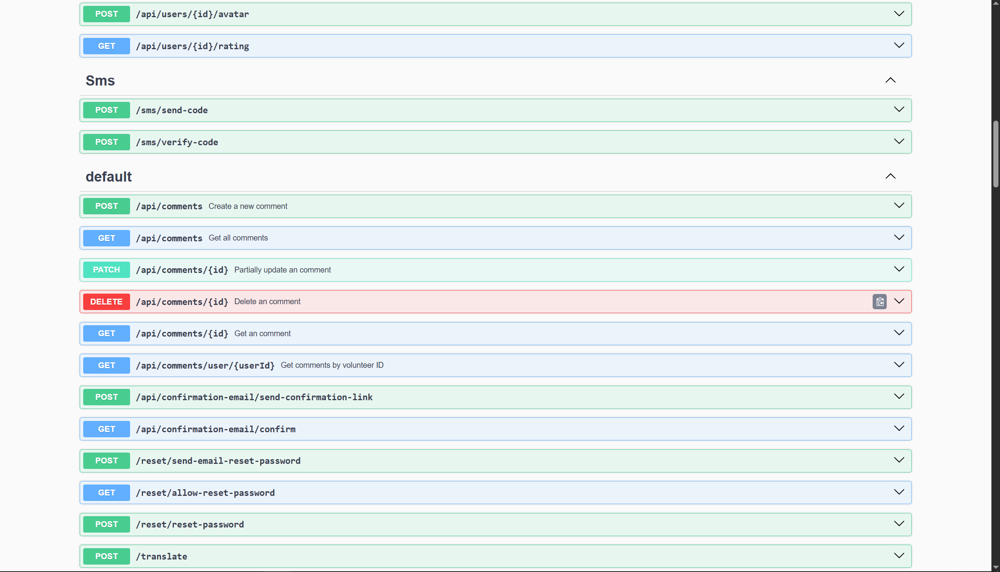

# Synara

This project aims to create an innovative online platform for support and mutual aid, connecting people who are willing to offer or receive help in various aspects of life. In today’s world, where individuals often experience isolation and a lack of support, our platform serves as a bridge between those in need and those ready to assist. The core functionalities of the web application include psychological support, assistance with groceries, and professional consultations.

## Features

- Adding announcements, petitions and gatherings
- Online chat and video chat
- Alerts Map
- Translation in english and ukrainian
- GoogleAuth, X(Twitter)Auth
- Search for the nearest volunteer or victim

## Tech Stack

**Client:** React, TypeScript, Redux, TailwindCSS

**Server:** NestJS, TypeScript

**Database:**  PostgreSQL, Redis

**Deployment:** AWS S3, AWS EC, AWS RDS

## Authors

Frontend:
- [Milana Pershyna](https://github.com/PershynaMilana)
- [Ilya Prigorniev](https://github.com/ilyalutiuprogrammer)

Backend:
- [Artem Ustimenko](https://github.com/ArtemUstimenko66)
- [Danil Bukhantsov](https://github.com/Danil5250)

## API requests examples

## Badges

